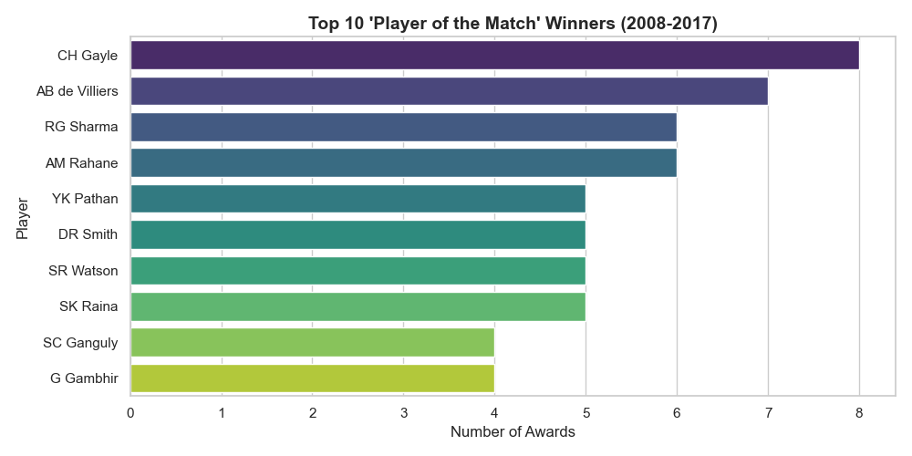
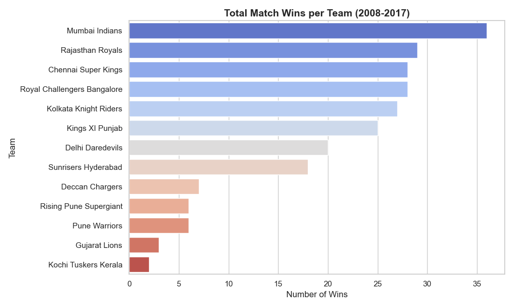
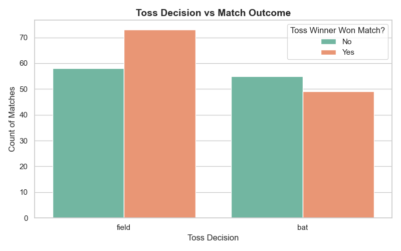
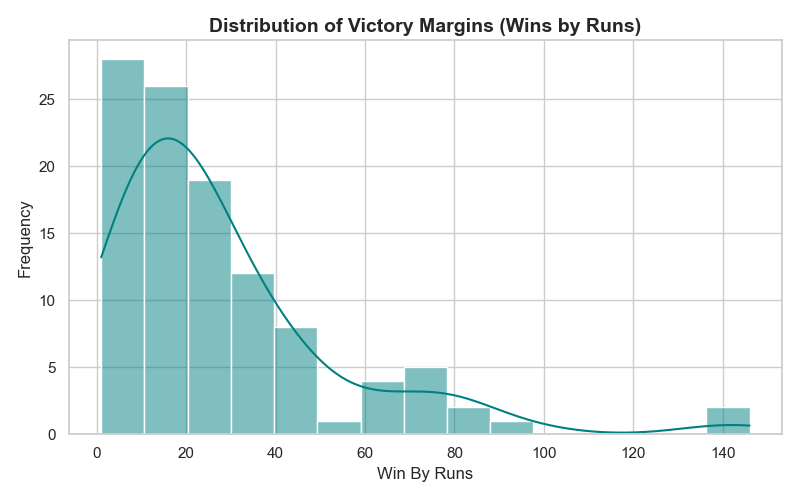

# IPL Data Cleaning & Exploratory Data Analysis (EDA)

A comprehensive Python project that takes raw Indian Premier League (IPL) match data, builds a robust data cleaning pipeline using `pandas`, and extracts actionable sports analytics insights using `matplotlib` and `seaborn`.

## 📌 Project Overview
The goal of this project was to transition from foundational data wrangling to full exploratory analysis. The pipeline cleans missing data, standardizes historical team name variations, and generates portfolio-ready visualizations highlighting key match variables such as team success rates, MVP metrics, and toss decision impact.

## 🛠️ Tech Stack & Libraries
* **Language:** Python
* **Data Wrangling:** Pandas, NumPy
* **Data Visualization:** Matplotlib, Seaborn

## 🧹 Data Cleaning Pipeline
Before conducting EDA, the raw dataset underwent the following rigorous quality checks and cleaning treatments:
1. **Structural Polish:** Dropped the entirely empty `umpire3` column to optimize dataframe space.
2. **Missing Values:** Handled critical null values by ensuring absolute coverage on rows containing match winners and dates.
3. **Data Type Standardization:** Converted the `date` feature to a uniform datetime format.
4. **Text Uniformity:** Standardized and stripped column names into lowercase snake_case. 
5. **Team Name Unification:** Mapped and consolidated inconsistent team naming conventions (e.g., merging duplicate categorical records like *Rising Pune Supergiants* into *Rising Pune Supergiant*).

---

## 📊 Exploratory Data Analysis & Key Insights

### 1. The MVP Factor (Player of the Match)
Analyzing individual match impacts revealed the most dominant players across this era of the IPL, heavily led by world-class impact hitters.

### 2. Most Successful Franchises
A breakdown of total match wins showcases which franchises historically dominated the league standings.

### 3. Toss Decision Strategy vs. Match Outcome
Does winning the toss and choosing to field give teams a mathematical edge? The data shows chasing teams win **55.7%** of the time after winning the toss, compared to just **47.1%** for teams electing to bat first.

### 4. Distribution of Victory Margins
Isolating matches won by the team batting first reveals the standard distribution of victory margins (Wins by Runs).

---

## 🚀 Key Takeaways
* **Chasing Over Defending:** There is a clear, statistically significant advantage for teams that win the toss and elect to field first.
* **Core Dominance:** **Mumbai Indians** established themselves as the most successful team within this specific decade of match history.
